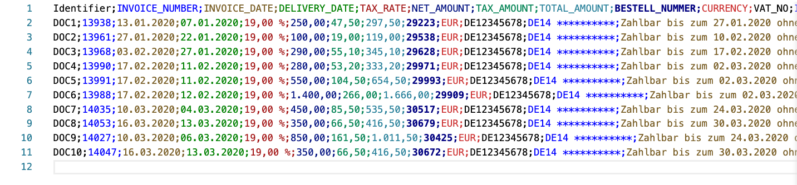
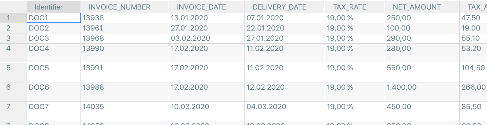
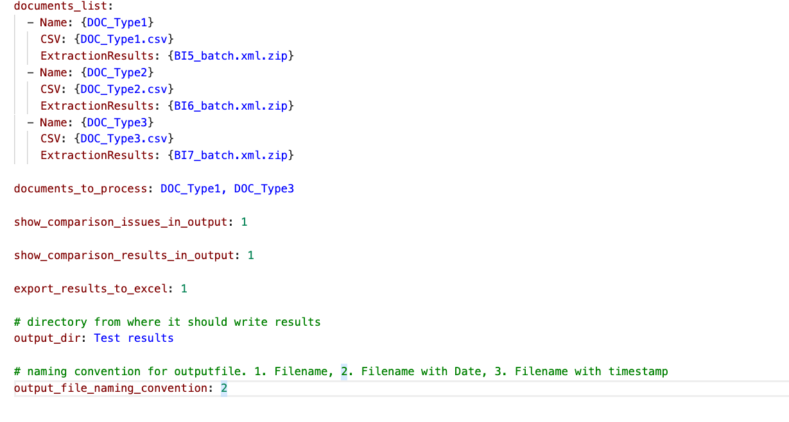

========================
How to configure it
========================

To compare ephesoft's extracted results with original/expected results.

We need:

- Original values CSVs (Original/expected values in csv format).
- Extraction results (Ephesoft extraction output zip file).
- Configurations yaml file. 

Original values CSVs
---------------------

Original values should be provided in CSV format where header values are the Ephesoft field names and values for each document in a new row.

Extraction results
---------------------
Ephesoft extraction output zip file can be found on machine where Ephesoft is installed in **ephesoft-system-folder**.
e.g. For the Batch instance **BI5** it is located at *C:\Ephesoft\SharedFolders\ephesoft-system-folder\BI5\BI5_batch.xml.zip*

Configurations yaml file
---------------------------

Template for the configurations file can be found at :

Here all values in {} need to be replaced with your own values. 

**documents_list**
    **Name**: Can we any name to distinguish different documents. Ideally it should be same name as mentioned in Epheosft.
    **CSV**: Filename containing original/expected values.
    **ExtractionResults**: Zip file name which contains Ephesoft's extracted results

**documents_to_process**
    Here you can give list of documents from above mentioned documents to process.

**show_comparison_issues_in_output**
    If set to 1, it will print the error on console.

**show_comparison_results_in_output**
    If set to 1, it will print comparions results on console

**export_results_to_excel**
    If set to 1, it will export the comparison results in an excel file.

**output_dir**
    Directory in which output results should be saved. 

**output_file_naming_convention**
    Naming convention for outputfile. 1. Filename, 2. Filename with Date, 3. Filename with timestamp
