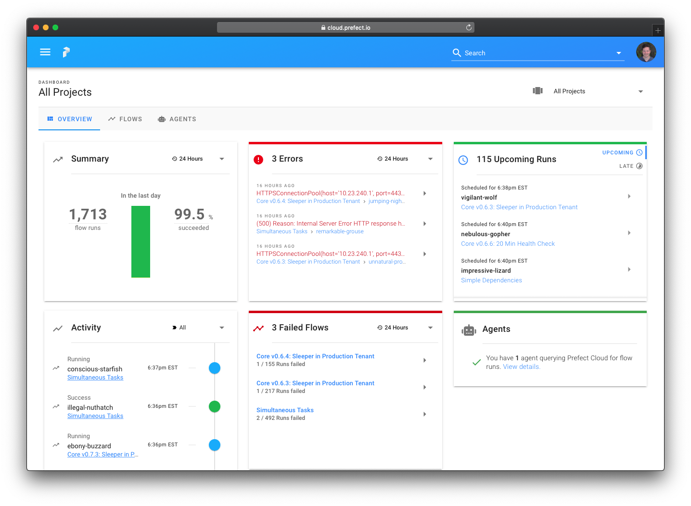

========
Installl
========

To install the docker image please use 

.. code-block:: bash

   docker run fellowconsulting/inforion

`Dockerhub Link <https://hub.docker.com/r/fellowconsulting/inforion>`_

In our docker container we use Prefect for the UI to dispaly the Workflows

For example start the docker container

Before you start check if you have created a conf directory. In the directory you should have following files:

- Mapping_Kundenstamm.xlsx
- credentials.yml
- IONAPI Key File
- module_dependencies.csv
- modules.csv

Start on Mac or Linux 
=====================
.. code-block:: bash

   docker run -v $PWD/conf:/ion-workflow/conf  fellowconsulting/inforion flow  -b /ion-workflow/conf -c credentials.yml -m modules.csv -d module_dependencies.csv 

Start on Windows
================

.. code-block:: bash

   docker run -v %cd%/conf:/ion-workflow/conf  fellowconsulting/inforion flow  -b /ion-workflow/conf -c credentials.yml -m modules.csv -d module_dependencies.csv 

Uprade to Latest Build 
======================

.. code-block:: bash

   docker pull fellowconsulting/inforion:latest      

